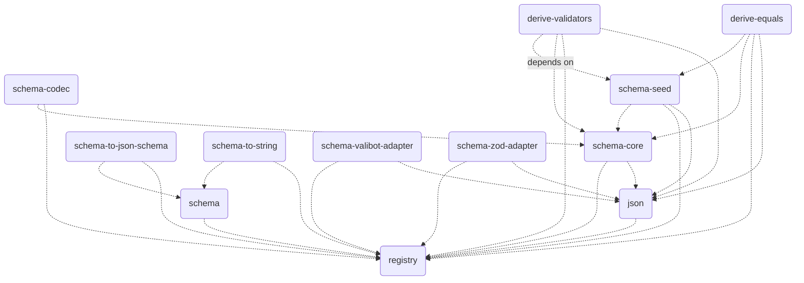

# `@traversable/schema`

A schema library that does a lot more, by doing strictly less.

This library exploits a TypeScript feature called
[inferred type predicates](https://devblogs.microsoft.com/typescript/announcing-typescript-5-5/#inferred-type-predicates)
to do what libaries like `zod` do, without the additional runtime overhead or abstraction.

> **Note:**
>
> These docs are a W.I.P.
>
> We recommend jumping straight to the [demo](https://tsplay.dev/NaBrBm).
>
> Or, to see how `@traversable/schema` stacks up against
> its largest competitor (zod), check out the [Playground](https://tsplay.dev/NaBrBm)

## Requirements

The only hard requirement is [TypeScript 5.5](https://devblogs.microsoft.com/typescript/announcing-typescript-5-5/).
Since the core primitive that `@traversable/schema` is built on top of is
[inferred type predicates](https://devblogs.microsoft.com/typescript/announcing-typescript-5-5/#inferred-type-predicates),
we do not have plans to backport to previous versions.

## Quick start

```typescript
import { t } from '@traversable/schema'

declare let ex_01: unknown

if (t.bigint(ex_01)) {
    ex_01
    // ^? let ex_01: bigint
}

const schema_01 = t.object({
  abc: t.optional(t.string),
  def: t.tuple(
    t.eq(1),
    t.optional(t.eq(2)), // `t.eq` can be used to match any literal JSON value
    t.optional(t.eq(3)),
  )
})

if (schema_01(ex_01)) {
    ex_01
    // ^? let ex_01: { abc?: string, def: [ᵃ: 1, ᵇ?: 2, ᶜ?: 3] }
}
```

### `.toString`

To add the `.toString` method to all schemas, all you need to do is import the `@traversable/schema-to-string`:

```typescript
import { t } from '@traversable/schema'
import '@traversable/schema-to-string'

const schema_02 = t.intersect(
  t.object({
    bool: t.optional(t.boolean),
    nested: t.object({
      int: t.integer,
      union: t.union(t.tuple(t.string), t.null),
    }),
    key: t.union(t.string, t.symbol, t.number),
  }),
  t.object({
    record: t.record(t.string),
    maybeArray: t.optional(t.array(t.string)),
    enum: t.enum('x', 'y', 1, 2, null),
  }),
)

let typeString = schema_02.toString
//  ^? let typeString: (
//       & { 'bool'?: boolean | undefined, 'key': string | symbol | number, 'nested': { 'union': [string] | null, 'int': number } } 
//       & { 'record': Record<string, string>, 'maybeArray'?: string[] | undefined, 'enum': 'x' | 'y' | 1 | 2 | null }
//     )
```

### `.jsonSchema`

To add the `.jsonSchema` method to all schemas, all you need to do is import the `@traversable/schema-to-json-schema`:

```typescript
import * as vi from 'vitest'

import { t } from '@traversable/schema'
import '@traversable/schema-to-json-schema'

const schema_02 = t.object({
  bool: t.optional(t.boolean),
  nested: t.object({
    int: t.integer,
    union: t.union(
      t.eq(1), 
      t.tuple(t.optional(t.string), t.null),
  }),
  key: t.union(t.string, t.symbol, t.number),
})

vi.assertType<{
  type: "object"
  required: ("nested" | "key")[]
  properties: { 
    bool: { type: "boolean" }
    nested: { 
      type: "object"
      required: ("int" | "union")[]
      properties: { 
        int: { type: "integer" }
        union: {
          anyOf: [
            { const: 1 }
            { 
              type: "array"
              items: [{ type: "string" }, { type: "null", enum: [null] }]
              minItems: 1
              maxItems: 2
              additionalItems: false
            }
          ]
        }
      }
    }
    key: { 
      anyOf: [{ type: "string" }, { type: "number" }]
    }
  }
}>(schema_02.jsonSchema())
```

### Dependency graph

