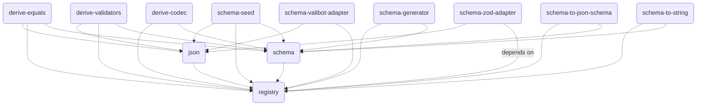

<br>
<h1 align="center">ᯓ𝘁𝗿𝗮𝘃𝗲𝗿𝘀𝗮𝗯𝗹𝗲/𝘀𝗰𝗵𝗲𝗺𝗮</h1>
<br>

<p align="center">
  A lightweight, modular schema library with opt-in power tools. 
  Extensible in userland via 
  <a href="https://developer.mozilla.org/en-US/docs/Web/JavaScript/Reference/Statements/import#import_a_module_for_its_side_effects_only" target="_blank">side-effect imports</a> 
  + <a href="https://www.typescriptlang.org/docs/handbook/declaration-merging.html#module-augmentation" target="_blank">module augmentation</a>.
</p>

<div align="center">
  
  &nbsp;
  
  &nbsp;
  
  &nbsp;
  
  &nbsp;
</div>

<div align="center">
  
  &nbsp;
  
  &nbsp;
  
  &nbsp;
</div>

<div align="center">
  <a href="https://stackblitz.com/edit/traversable?file=src%2Fsandbox.tsx" target="_blank">Demo (StackBlitz)</a>
  <span>&nbsp;&nbsp;•&nbsp;&nbsp;</span>
  <a href="https://tsplay.dev/w2y29W" target="_blank">TypeScript Playground</a>
  <span>&nbsp;&nbsp;•&nbsp;&nbsp;</span>
  <a href="https://www.npmjs.com/package/@traversable/schema" target="_blank">npm</a>
  <br />
</div>
<br />

<br />

`@traversable/schema` exploits a TypeScript feature called
[inferred type predicates](https://devblogs.microsoft.com/typescript/announcing-typescript-5-5/#inferred-type-predicates)
to do what libaries like `zod` do, without the additional runtime overhead or abstraction.

> **Note:**
>
> These docs are a W.I.P.
>
> We recommend jumping straight to the [demo](https://stackblitz.com/edit/traversable?file=src%2Fsandbox.tsx) 
> or [playground](https://tsplay.dev/w2y29W).

## Requirements

The only hard requirement is [TypeScript 5.5](https://devblogs.microsoft.com/typescript/announcing-typescript-5-5/).
Since the core primitive that `@traversable/schema` is built on top of is
[inferred type predicates](https://devblogs.microsoft.com/typescript/announcing-typescript-5-5/#inferred-type-predicates),
we do not have plans to backport to previous versions.

## Quick start

```typescript
import { t } from '@traversable/schema'

declare let ex_01: unknown

if (t.bigint(ex_01)) {
    ex_01
    // ^? let ex_01: bigint
}

const schema_01 = t.object({
  abc: t.optional(t.string),
  def: t.tuple(
    t.eq(1),
    t.optional(t.eq(2)), // `t.eq` can be used to match any literal JSON value
    t.optional(t.eq(3)),
  )
})

if (schema_01(ex_01)) {
    ex_01
    // ^? let ex_01: { abc?: string, def: [ᵃ: 1, ᵇ?: 2, ᶜ?: 3] }
    //                                     ^ tuples are labeled to support optionality
}
```


## Features

`@traversable/schema` is modular by schema (like valibot), but takes it a step further by making its feature set opt-in by default.

The ability to add features like this is a knock-on effect of traversable's extensible core.

### First-class support for inferred type predicates

> **Note:** This is the only feature on this list that is built into the core library.

The motivation for creating another schema library was to add native support for inferred type predicates,
which no other schema library currently does (although please file an issue if that has changed!).

This is possible because the traversable schemas are themselves just type predicates with a few additional properties
that allow them to also be used for reflection.

- **Instructions:** To use this feature, define a predicate inline and `@traversable/schema` will figure out the rest.

#### Example

You can play with this example in the <a href="https://tsplay.dev/WkJD2m" target="_blank">TypeScript Playground</a>.

```typescript
import { t } from '@traversable/schema'

export let Classes = t.object({
  promise: (v) => v instanceof Promise,
  set: (v) => v instanceof Set,
  map: (v) => v instanceof Map,
  weakMap: (v) => v instanceof WeakMap,
  date: (v) => v instanceof Date,
  regex: (v) => v instanceof RegExp,
  error: (v) => v instanceof Error,
  typeError: (v) => v instanceof TypeError,
  syntaxError: (v) => v instanceof SyntaxError,
  buffer: (v) => v instanceof ArrayBuffer,
  readableStream: (v) => v instanceof ReadableStream,
})

type Classes = t.typeof<typeof Classes>
//   ^? type Classes = {
//   promise: Promise<any>
//   set: Set<any>
//   map: Map<any, any>
//   weakMap: WeakMap<object, any>
//   date: Date
//   regex: RegExp
//   error: Error
//   typeError: TypeError
//   syntaxError: SyntaxError
//   buffer: ArrayBuffer
//   readableStream: ReadableStream<any>
// }

let Values = t.object({
  function: (v) => typeof v === 'function',
  successStatus: (v) => v === 200 || v === 201 || v === 202 || v === 204,
  clientErrorStatus: (v) => v === 400 || v === 401 || v === 403 || v === 404,
  serverErrorStatus: (v) => v === 500 || v === 502 || v === 503,
  teapot: (v) => v === 418,
  true: (v) => v === true,
  false: (v) => v === false,
  mixed: (v) => Array.isArray(v) || v === true,
  startsWith: (v): v is `bill${string}` => typeof v === 'string' && v.startsWith('bill'),
  endsWith: (v): v is `${string}murray` => typeof v === 'string' && v.endsWith('murral'),
})

type Values = t.typeof<typeof Values>
//   ^? type Values = {
//   function: Function
//   successStatus: 200 | 201 | 202 | 204
//   clientErrorStatus: 400 | 401 | 403 | 404
//   serverErrorStatus: 500 | 502 | 503
//   teapot: 418
//   true: true
//   false: false
//   mixed: true | any[]
//   startsWith: `bill${string}`
//   endsWith: `${string}murray`
// }

let Shorthand = t.object({
    nonnullable: Boolean,
    unknown: () => true,
    never: () => false,
})

type Shorthand = t.typeof<typeof Shorthand>
//   ^? type Shorthand = {
//   nonnullable: {}
//   unknown: unknown
//   never?: never
// }
```

### `.validate`

`.validate` is similar to `z.safeParse`, except more than an order of magnitude faster*.

- **Instructions:** To install the `.validate` method to all schemas, simply import `@traversable/derive-validators/install`.
- [ ] TODO: add benchmarks + write-up

#### Example

Play with this example in the [TypeScript playground](https://tsplay.dev/NaBEPm).

```typescript
import { t } from '@traversable/schema'
import '@traversable/derive-validators/install'
//      ↑↑ importing `@traversable/derive-validators/install` adds `.validate` to all schemas

let schema_01 = t.object({ 
  product: t.object({ 
    x: t.integer, 
    y: t.integer 
  }), 
  sum: t.union(
    t.tuple(t.eq(0), t.integer), 
    t.tuple(t.eq(1), t.integer),
  ),
})

let result = schema_01.validate({ product: { x: null }, sum: [2, 3.141592]})
//                     ↑↑ .validate is available

console.log(result)
// => 
// [
//   { "kind": "TYPE_MISMATCH", "path": [ "product", "x" ], "expected": "number", "got": null },
//   { "kind": "REQUIRED", "path": [ "product" ], "msg": "Missing key 'y'" },
//   { "kind": "TYPE_MISMATCH", "path": [ "sum", 0 ], "expected": 0, "got": 2 },
//   { "kind": "TYPE_MISMATCH", "path": [ "sum", 1 ], "expected": "number", "got": 3.141592 },
//   { "kind": "TYPE_MISMATCH", "path": [ "sum", 0 ], "expected": 1, "got": 2 },
//   { "kind": "TYPE_MISMATCH", "path": [ "sum", 1 ], "expected": "number", "got": 3.141592 },
// ]
```

### `.toString`

The `.toString` method prints a stringified version of the type that the schema represents.

Works on both the term- and type-level.

- **Instructions:** To install the `.toString` method on all schemas, simply import `@traversable/schema-to-string/install`.

- Caveat: type-level functionality is provided as a heuristic only; since object keys are unordered in the TS type system, the order that the
keys are printed at runtime might differ from the order they appear on the type-level.

#### Example

Play with this example in the [TypeScript playground](https://tsplay.dev/W49jew)

```typescript
import { t } from '@traversable/schema'
import '@traversable/schema-to-string/install'
//      ↑↑ importing `@traversable/schema-to-string/install` adds the upgraded `.toString` method on all schemas

const schema_02 = t.intersect(
  t.object({
    bool: t.optional(t.boolean),
    nested: t.object({
      int: t.integer,
      union: t.union(t.tuple(t.string), t.null),
    }),
    key: t.union(t.string, t.symbol, t.number),
  }),
  t.object({
    record: t.record(t.string),
    maybeArray: t.optional(t.array(t.string)),
    enum: t.enum('x', 'y', 1, 2, null),
  }),
)

let ex_02 = schema_02.toString()
//  ^? let ex_02: "({ 
//       'bool'?: (boolean | undefined), 
//       'nested': { 'int': number, 'union': ([string] | null) }, 
//       'key': (string | symbol | number) } 
//     & { 
//        'record': Record<string, string>, 
//        'maybeArray'?: ((string)[] | undefined), 
//        'enum': 'x' | 'y' | 1 | 2 | null 
//     })"
```

### `.toJsonSchema`

- **Instructions:** To install the `.toJsonSchema` method on all schemas, simply import `@traversable/schema-to-json-schema/install`.

#### Example

Play with this example in the [TypeScript playground](https://tsplay.dev/NB98Vw).

```typescript
import * as vi from 'vitest'

import { t } from '@traversable/schema'
import '@traversable/schema-to-json-schema/install'
//      ↑↑ importing `@traversable/schema-to-json-schema/install` adds `.toJsonSchema` on all schemas

const schema_02 = t.intersect(
  t.object({
    stringWithMaxExample: t.optional(t.string.max(255)),
    nestedObjectExample: t.object({
      integerExample: t.integer,
      tupleExample: t.tuple(
        t.eq(1),
        t.optional(t.eq(2)),
        t.optional(t.eq(3)),
      ),
    }),
    stringOrNumberExample: t.union(t.string, t.number),
  }),
  t.object({
    recordExample: t.record(t.string),
    arrayExample: t.optional(t.array(t.string)),
    enumExample: t.enum('x', 'y', 1, 2, null),
  }),
)

vi.assertType<{
  allOf: [
    {
      type: "object"
      required: ("nestedObjectExample" | "stringOrNumberExample")[]
      properties: {
        stringWithMaxExample: { type: "string", minLength: 3 }
        stringOrNumberExample: { anyOf: [{ type: "string" }, { type: "number" }] }
        nestedObjectExample: {
          type: "object"
          required: ("integerExample" | "tupleExample")[]
          properties: {
            integerExample: { type: "integer" }
            tupleExample: {
              type: "array"
              minItems: 1
              maxItems: 3
              items: [{ const: 1 }, { const: 2 }, { const: 3 }]
              additionalItems: false
            }
          }
        }
      }
    },
    {
      type: "object"
      required: ("recordExample" | "enumExample")[]
      properties: {
        recordExample: { type: "object", additionalProperties: { type: "string" } }
        arrayExample: { type: "array", items: { type: "string" } }
        enumExample: { enum: ["x", "y", 1, 2, null] }
      }
    }
  ]
}>(schema_02.toJsonSchema())
//           ↑↑ importing `@traversable/schema-to-json-schema` installs `.toJsonSchema`
```

### Codec (`.pipe`, `.extend`, `.parse`, `.decode` & `.encode`)

- **Instructions:** to install the `.codec` method on all schemas, all you need to do is import `@traversable/derive-codec`.
  - To create a covariant codec (similar to zod's `.transform`), use `.codec.pipe`
  - To create a contravariant codec (similar to zod's `.preprocess`), use `.codec.extend` (WIP)

#### Example

Play with this example in the [TypeScript playground](https://tsplay.dev/mbbv3m).

```typescript
import { t } from '@traversable/schema'
import '@traversable/derive-codec/install'
//      ↑↑ importing `@traversable/derive-codec/install` adds `.codec` on all schemas

let User = t
  .object({ name: t.optional(t.string), createdAt: t.string })
  .codec // <-- notice we're pulling off the `.codec` property
  .pipe((user) => ({ ...user, createdAt: new Date(user.createdAt) }))
  .unpipe((user) => ({ ...user, createdAt: user.createdAt.toISOString() }))

let fromAPI = User.parse({ name: 'Bill Murray', createdAt: new Date().toISOString() })
//   ^?  let fromAPI: Error | { name?: string, createdAt: Date}

if (fromAPI instanceof Error) throw fromAPI
fromAPI
// ^? { name?: string, createdAt: Date }

let toAPI = User.encode(fromAPI)
//  ^? let toAPI: { name?: string, createdAt: string }
```

## Dependency graph


