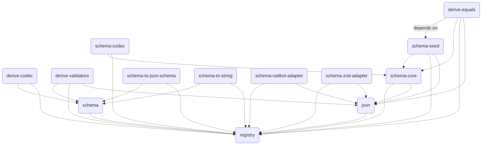

# `@traversable/schema`

A schema library that does a lot more, by doing strictly less.

This library exploits a TypeScript feature called
[inferred type predicates](https://devblogs.microsoft.com/typescript/announcing-typescript-5-5/#inferred-type-predicates)
to do what libaries like `zod` do, without the additional runtime overhead or abstraction.

> **Note:**
>
> These docs are a W.I.P.
>
> We recommend jumping straight to the [demo](https://tsplay.dev/NaBrBm).
>
> Or, to see how `@traversable/schema` stacks up against
> its largest competitor (zod), check out the [Playground](https://tsplay.dev/NaBrBm)

## Requirements

The only hard requirement is [TypeScript 5.5](https://devblogs.microsoft.com/typescript/announcing-typescript-5-5/).
Since the core primitive that `@traversable/schema` is built on top of is
[inferred type predicates](https://devblogs.microsoft.com/typescript/announcing-typescript-5-5/#inferred-type-predicates),
we do not have plans to backport to previous versions.

## Quick start

```typescript
import { t } from '@traversable/schema'

declare let ex_01: unknown

if (t.bigint(ex_01)) {
    ex_01
    // ^? let ex_01: bigint
}

const schema_01 = t.object({
  abc: t.optional(t.string),
  def: t.tuple(
    t.eq(1),
    t.optional(t.eq(2)), // `t.eq` can be used to match any literal JSON value
    t.optional(t.eq(3)),
  )
})

if (schema_01(ex_01)) {
    ex_01
    // ^? let ex_01: { abc?: string, def: [ᵃ: 1, ᵇ?: 2, ᶜ?: 3] }
}
```

## Features

`@traversable/schema` is modular by schema (like valibot), but takes it a step further by making its feature set opt-in by default.

The ability to add features like this is a knock-on effect of traversable's extensible core.

### Native support for inferred type predicates

> **Note:** This is the only feature on this list that is built into the core library.

The motivation for creating another schema library was to add native support for inferred type predicates,
which none of the other libraries on the market currently do.

This is possible because the traversable schemas are themselves just type predicates with a few additional properties
that allow them to also be used for reflection.

- **Instructions:** To use this feature, define a predicate inline and `@traversable/schema` will figure out the rest.

#### Example

You can play with this example in the [TypeScript Playground](https://tsplay.dev/WkJD2m).

```typescript
import { t } from '@traversable/schema'

export let Classes = t.object({
  promise: (v) => v instanceof Promise,
  set: (v) => v instanceof Set,
  map: (v) => v instanceof Map,
  weakMap: (v) => v instanceof WeakMap,
  date: (v) => v instanceof Date,
  regex: (v) => v instanceof RegExp,
  error: (v) => v instanceof Error,
  typeError: (v) => v instanceof TypeError,
  syntaxError: (v) => v instanceof SyntaxError,
  buffer: (v) => v instanceof ArrayBuffer,
  readableStream: (v) => v instanceof ReadableStream,
})

type Classes = t.typeof<typeof Classes>
//   ^? type Classes = {
//   promise: Promise<any>
//   set: Set<any>
//   map: Map<any, any>
//   weakMap: WeakMap<object, any>
//   date: Date
//   regex: RegExp
//   error: Error
//   typeError: TypeError
//   syntaxError: SyntaxError
//   buffer: ArrayBuffer
//   readableStream: ReadableStream<any>
// }

let Values = t.object({
  function: (v) => typeof v === 'function',
  successStatus: (v) => v === 200 || v === 201 || v === 202 || v === 204,
  clientErrorStatus: (v) => v === 400 || v === 401 || v === 403 || v === 404,
  serverErrorStatus: (v) => v === 500 || v === 502 || v === 503,
  teapot: (v) => v === 418,
  true: (v) => v === true,
  false: (v) => v === false,
  mixed: (v) => Array.isArray(v) || v === true,
  startsWith: (v): v is `bill${string}` => typeof v === 'string' && v.startsWith('bill'),
  endsWith: (v): v is `${string}murray` => typeof v === 'string' && v.endsWith('murral'),
})

type Values = t.typeof<typeof Values>
//   ^? type Values = {
//   function: Function
//   successStatus: 200 | 201 | 202 | 204
//   clientErrorStatus: 400 | 401 | 403 | 404
//   serverErrorStatus: 500 | 502 | 503
//   teapot: 418
//   true: true
//   false: false
//   mixed: true | any[]
//   startsWith: `bill${string}`
//   endsWith: `${string}murray`
// }

let Shorthand = t.object({
    nonnullable: Boolean,
    unknown: () => true,
    never: () => false,
})

type Shorthand = t.typeof<typeof Shorthand>
//   ^? type Shorthand = {
//   nonnullable: {}
//   unknown: unknown
//   never?: never
// }
```

### `.validate`

`.validate` is similar to `z.safeParse`, except more than an order of magnitude faster*.

- **Instructions:** To install the `.validate` method to all schemas, all you need to do is import `@traversable/derive-validators`.
- [ ] TODO: add benchmarks + write-up

#### Example

Play with this example in the [TypeScript playground](https://tsplay.dev/NaBEPm).

```typescript
import { t } from '@traversable/schema'
import '@traversable/derive-validators'

let schema_01 = t.object({ 
  productType: t.object({ 
    x: t.integer, 
    y: t.integer 
  }), 
  sumType: t.union(
    t.tuple(t.eq(0), t.integer), 
    t.tuple(t.eq(1), t.integer),
  ),
})

let result = schema_01.validate({ productType: { x: null }, sumType: [2, 3.141592]})
//                     ↑↑ importing `@traversable/derive-validators` installs `.validate`

console.log(result)
// => 
// [
//   { "kind": "TYPE_MISMATCH", "path": [ "productType", "x" ], "expected": "number", "got": null },
//   { "kind": "REQUIRED", "path": [ "productType" ], "msg": "Missing key 'y'" },
//   { "kind": "TYPE_MISMATCH", "path": [ "sumType", 0 ], "expected": 0, "got": 2 },
//   { "kind": "TYPE_MISMATCH", "path": [ "sumType", 1 ], "expected": "number", "got": 3.141592 },
//   { "kind": "TYPE_MISMATCH", "path": [ "sumType", 0 ], "expected": 1, "got": 2 },
//   { "kind": "TYPE_MISMATCH", "path": [ "sumType", 1 ], "expected": "number", "got": 3.141592 },
// ]
```

### `.toString`

The `.toString` method prints a stringified version of the type that the schema represents.

Works on both the term- and type-level.

- **Instructions:** To install the `.toString` method on all schemas, all you need to do is import `@traversable/schema-to-string`.

- Caveat: type-level functionality is provided as a guide; since object keys are unordered in the TS type system, the order that the
keys are printed at runtime might differ from the order they appear on the type-level.

#### Example

Play with this example in the [TypeScript playground](https://tsplay.dev/W49jew)

```typescript
import { t } from '@traversable/schema'
import '@traversable/schema-to-string'

const schema_02 = t.intersect(
  t.object({
    bool: t.optional(t.boolean),
    nested: t.object({
      int: t.integer,
      union: t.union(t.tuple(t.string), t.null),
    }),
    key: t.union(t.string, t.symbol, t.number),
  }),
  t.object({
    record: t.record(t.string),
    maybeArray: t.optional(t.array(t.string)),
    enum: t.enum('x', 'y', 1, 2, null),
  }),
)

//                    ↓↓ importing `@traversable/schema-to-string` installs `.toString`
let ex_02 = schema_02.toString()
//  ^? let ex_02: "({ 
//       'bool'?: (boolean | undefined), 
//       'nested': { 'int': number, 'union': ([string] | null) }, 
//       'key': (string | symbol | number) } 
//     & { 
//        'record': Record<string, string>, 
//        'maybeArray'?: ((string)[] | undefined), 
//        'enum': 'x' | 'y' | 1 | 2 | null 
//     })"
```

### `.jsonSchema`

- **Instructions:** To install the `.jsonSchema` method on all schemas, all you need to do is import `@traversable/schema-to-json-schema`.

#### Example

Play with this example in the [TypeScript playground](https://tsplay.dev/Wy0qdm).

```typescript
import * as vi from 'vitest'

import { t } from '@traversable/schema'
import '@traversable/schema-to-json-schema'

const schema_02 = t.intersect(
  t.object({
    booleanExample: t.optional(t.boolean),
    nestedObjectExample: t.object({
      integerExample: t.integer,
      tupleExample: t.tuple(
        t.eq(1),
        t.optional(t.eq(2)),
        t.optional(t.eq(3)),
        // t.eq(4),
        // ^^ Uncomment this line to raise a TypeError:
        // 🚫 't.null' is not assignable to 'TypeError<"A required element cannot follow an optional element.">'
      ),
    }),
    stringOrNumberExample: t.union(t.string, t.number),
  }),
  t.object({
    recordExample: t.record(t.string),
    arrayExample: t.optional(t.array(t.string)),
    enumExample: t.enum('x', 'y', 1, 2, null),
  }),
)

vi.assertType<{
  allOf: [
    {
      type: "object"
      required: ("nestedObjectExample" | "stringOrNumberExample")[]
      properties: {
        booleanExample: { type: "boolean" }
        stringOrNumberExample: { anyOf: [{ type: "string" }, { type: "number" }] }
        nestedObjectExample: {
          type: "object"
          required: ("integerExample" | "tupleExample")[]
          properties: {
            integerExample: { type: "integer" }
            tupleExample: {
              type: "array"
              minItems: 1
              maxItems: 3
              items: [{ const: 1 }, { const: 2 }, { const: 3 }]
              additionalItems: false
            }
          }
        }
      }
    },
    {
      type: "object"
      required: ("recordExample" | "enumExample")[]
      properties: {
        recordExample: { type: "object", additionalProperties: { type: "string" } }
        arrayExample: { type: "array", items: { type: "string" } }
        enumExample: { enum: ["x", "y", 1, 2, null] }
      }
    }
  ]
}>(schema_02.jsonSchema())
//           ↑↑ importing `@traversable/schema-to-json-schema` installs `.jsonSchema`
```

## Dependency graph


  
  
  
https://tsplay.dev/Wv9qRm).
