 
<h1 align="center">ᯓ𝘁𝗿𝗮𝘃𝗲𝗿𝘀𝗮𝗯𝗹𝗲/𝘀𝗰𝗵𝗲𝗺𝗮</h1>
 

TypeScript schema rewriter

  
  &nbsp;
  
  &nbsp;
  
  &nbsp;

  <!-- 
  &nbsp; -->
  
  &nbsp;
  
  &nbsp;
  

 

 

## Overview

A schema is a syntax tree. ASTs lend themselves to (re)-interpretation. If you're not treating your TypeScript schemas like ASTs, you're missing out.

`@traversable/schema` makes it easy to do anything with a TypeScript schema.

### What's a "schema rewriter"?

The idea of term rewriting comes from the programming language community. Languages like [Racket](https://planet.racket-lang.org/package-source/samsergey/rewrite.plt/1/0/planet-docs/manual/index.html) and [Lean](https://lean-lang.org/doc/reference/latest/The-Simplifier/Rewrite-Rules/) invert control and give users a first-class API for rewriting and extending the language.

Unfortunately, we don't have that kind of power in TypeScript because we're limited by the target language (JavaScript). And frankly, given how flexible JavaScript already is, exposing that kind of API would be a recipe for disaster.

We do however have schemas, and schemas are basically ASTs.

## Integrations

<ul>
  <li><a href="https://github.com/traversable/schema/tree/main/packages/arktype"><code>@traversable/arktype@0.0.2</code></a></li>
  <li><a href="https://github.com/traversable/schema/tree/main/packages/arktype-test"><code>@traversable/arktype-test@0.0.2</code></a></li>
  <li><a href="https://github.com/traversable/schema/tree/main/packages/arktype-types"><code>@traversable/arktype-types@0.0.2</code></a></li>
  <li><a href="https://github.com/traversable/schema/tree/main/packages/json-schema"><code>@traversable/json-schema@0.0.3</code></a></li>
  <li><a href="https://github.com/traversable/schema/tree/main/packages/json-schema-test"><code>@traversable/json-schema-test@0.0.3</code></a></li>
  <li><a href="https://github.com/traversable/schema/tree/main/packages/json-schema-types"><code>@traversable/json-schema-types@0.0.3</code></a></li>
  <li><a href="https://github.com/traversable/schema/tree/main/packages/typebox"><code>@traversable/typebox@0.0.7</code></a></li>
  <li><a href="https://github.com/traversable/schema/tree/main/packages/typebox-test"><code>@traversable/typebox-test@0.0.4</code></a></li>
  <li><a href="https://github.com/traversable/schema/tree/main/packages/typebox-types"><code>@traversable/typebox-types@0.0.2</code></a></li>
  <li><a href="https://github.com/traversable/schema/tree/main/packages/zod"><code>@traversable/zod@0.0.12</code></a></li>
  <li><a href="https://github.com/traversable/schema/tree/main/packages/zod-test"><code>@traversable/zod-test@0.0.5</code></a></li>
  <li><a href="https://github.com/traversable/schema/tree/main/packages/zod-types"><code>@traversable/zod-types@0.0.3</code></a></li>
</ul>

## Libraries

<ul>
  <li><a href="https://github.com/traversable/schema/tree/main/packages/json"><code>@traversable/json@0.0.35</code></a></li>
  <li><a href="https://github.com/traversable/schema/tree/main/packages/registry"><code>@traversable/registry@0.0.34</code></a></li>
  <li><a href="https://github.com/traversable/schema/tree/main/packages/schema"><code>@traversable/schema@0.0.47</code></a></li>
  <li><a href="https://github.com/traversable/schema/tree/main/packages/schema-codec"><code>@traversable/schema-codec@0.0.17</code></a></li>
  <li><a href="https://github.com/traversable/schema/tree/main/packages/schema-compiler"><code>@traversable/schema-compiler@0.0.12</code></a></li>
  <li><a href="https://github.com/traversable/schema/tree/main/packages/schema-errors"><code>@traversable/schema-errors@0.0.12</code></a></li>
  <li><a href="https://github.com/traversable/schema/tree/main/packages/schema-deep-equal"><code>@traversable/schema-deep-equal@0.0.0</code></a></li>
  <li><a href="https://github.com/traversable/schema/tree/main/packages/schema-seed"><code>@traversable/schema-seed@0.0.35</code></a></li>
  <li><a href="https://github.com/traversable/schema/tree/main/packages/schema-to-json-schema"><code>@traversable/schema-to-json-schema@0.0.34</code></a></li>
  <li><a href="https://github.com/traversable/schema/tree/main/packages/schema-to-string"><code>@traversable/schema-to-string@0.0.34</code></a></li>
  <li><a href="https://github.com/traversable/schema/tree/main/packages/schema-to-validator"><code>@traversable/schema-to-validator@0.0.0</code></a></li>
</ul>

## Dependency graph

```mermaid
flowchart TD
    arktype(arktype)
    json-schema(json-schema)
    json-schema-test(json-schema-test)
    registry(registry)
    typebox(typebox)
    zod(zod)
    arktype-test(arktype-test) -.-> registry(registry)
    json(json) -.-> registry(registry)
    schema(schema) -.-> registry(registry)
    typebox-test(typebox-test) -.-> registry(registry)
    zod-test(zod-test) -.-> registry(registry)
    arktype-types(arktype-types) -.-> json(json)
    arktype-types(arktype-types) -.-> registry(registry)
    json-schema-types(json-schema-types) -.-> json(json)
    json-schema-types(json-schema-types) -.-> registry(registry)
    schema-codec(schema-codec) -.-> registry(registry)
    schema-codec(schema-codec) -.-> schema(schema)
    schema-compiler(schema-compiler) -.-> json(json)
    schema-compiler(schema-compiler) -.-> registry(registry)
    schema-compiler(schema-compiler) -.-> schema(schema)
    schema-deep-equal(schema-deep-equal) -.-> json(json)
    schema-deep-equal(schema-deep-equal) -.-> registry(registry)
    schema-deep-equal(schema-deep-equal) -.-> schema(schema)
    schema-errors(schema-errors) -.-> json(json)
    schema-errors(schema-errors) -.-> registry(registry)
    schema-errors(schema-errors) -.-> schema(schema)
    schema-seed(schema-seed) -.-> json(json)
    schema-seed(schema-seed) -.-> registry(registry)
    schema-seed(schema-seed) -.-> schema(schema)
    schema-to-json-schema(schema-to-json-schema) -.-> registry(registry)
    schema-to-json-schema(schema-to-json-schema) -.-> schema(schema)
    schema-to-string(schema-to-string) -.-> registry(registry)
    schema-to-string(schema-to-string) -.-> schema(schema)
    schema-to-validator(schema-to-validator) -.-> json(json)
    schema-to-validator(schema-to-validator) -.-> registry(registry)
    schema-to-validator(schema-to-validator) -.-> schema(schema)
    schema-valibot-adapter(schema-valibot-adapter) -.-> json(json)
    schema-valibot-adapter(schema-valibot-adapter) -.-> registry(registry)
    typebox-types(typebox-types) -.-> json(json)
    typebox-types(typebox-types) -.-> registry(registry)
    zod-types(zod-types) -.-> json(json)
    zod-types(zod-types) -.depends on.-> registry(registry)
```

