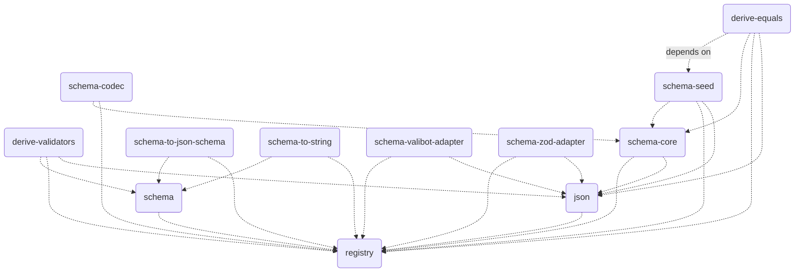

# `@traversable/schema`

A schema library that does a lot more, by doing strictly less.

This library exploits a TypeScript feature called
[inferred type predicates](https://devblogs.microsoft.com/typescript/announcing-typescript-5-5/#inferred-type-predicates)
to do what libaries like `zod` do, without the additional runtime overhead or abstraction.

> **Note:**
>
> These docs are a W.I.P.
>
> We recommend jumping straight to the [demo](https://tsplay.dev/NaBrBm).
>
> Or, to see how `@traversable/schema` stacks up against
> its largest competitor (zod), check out the [Playground](https://tsplay.dev/NaBrBm)

## Requirements

The only hard requirement is [TypeScript 5.5](https://devblogs.microsoft.com/typescript/announcing-typescript-5-5/).
Since the core primitive that `@traversable/schema` is built on top of is
[inferred type predicates](https://devblogs.microsoft.com/typescript/announcing-typescript-5-5/#inferred-type-predicates),
we do not have plans to backport to previous versions.

## Quick start

```typescript
import { t } from '@traversable/schema'

declare let ex_01: unknown

if (t.bigint(ex_01)) {
    ex_01
    // ^? let ex_01: bigint
}

const schema_01 = t.object({
  abc: t.optional(t.string),
  def: t.tuple(
    t.eq(1),
    t.optional(t.eq(2)), // `t.eq` can be used to match any literal JSON value
    t.optional(t.eq(3)),
  )
})

if (schema_01(ex_01)) {
    ex_01
    // ^? let ex_01: { abc?: string, def: [ᵃ: 1, ᵇ?: 2, ᶜ?: 3] }
}
```

### Inferred type predicates

The motivation for creating another schema library was to add native support for inferred type predicates,
which none of the other libraries on the market currently do.

The reason this is possible is because the traversable schemas are themselves just type predicates with
additional properties, which allows them to be re-used for reflection.

To take advantage of this feature, just define a predicate inline, and `@traversable/schema` will figure
out the rest.

#### Example

You can play with this example in the [TypeScript Playground](https://tsplay.dev/WkJD2m).

```typescript
import { t } from '@traversable/schema'

export let Classes = t.object({
  promise: (v) => v instanceof Promise,
  set: (v) => v instanceof Set,
  map: (v) => v instanceof Map,
  weakMap: (v) => v instanceof WeakMap,
  date: (v) => v instanceof Date,
  regex: (v) => v instanceof RegExp,
  error: (v) => v instanceof Error,
  typeError: (v) => v instanceof TypeError,
  syntaxError: (v) => v instanceof SyntaxError,
  buffer: (v) => v instanceof ArrayBuffer,
  readableStream: (v) => v instanceof ReadableStream,
})

type Classes = t.typeof<typeof Classes>
//   ^? type Classes = {
//   promise: Promise<any>
//   set: Set<any>
//   map: Map<any, any>
//   weakMap: WeakMap<object, any>
//   date: Date
//   regex: RegExp
//   error: Error
//   typeError: TypeError
//   syntaxError: SyntaxError
//   buffer: ArrayBuffer
//   readableStream: ReadableStream<any>
// }

let Values = t.object({
  function: (v) => typeof v === 'function',
  successStatus: (v) => v === 200 || v === 201 || v === 202 || v === 204,
  clientErrorStatus: (v) => v === 400 || v === 401 || v === 403 || v === 404,
  serverErrorStatus: (v) => v === 500 || v === 502 || v === 503,
  teapot: (v) => v === 418,
  true: (v) => v === true,
  false: (v) => v === false,
  mixed: (v) => Array.isArray(v) || v === true,
  startsWith: (v): v is `bill${string}` => typeof v === 'string' && v.startsWith('bill'),
  endsWith: (v): v is `${string}murray` => typeof v === 'string' && v.endsWith('murral'),
})

type Values = t.typeof<typeof Values>
//   ^? type Values = {
//   function: Function
//   successStatus: 200 | 201 | 202 | 204
//   clientErrorStatus: 400 | 401 | 403 | 404
//   serverErrorStatus: 500 | 502 | 503
//   teapot: 418
//   true: true
//   false: false
//   mixed: true | any[]
//   startsWith: `bill${string}`
//   endsWith: `${string}murray`
// }

let Shorthand = t.object({
    nonnullable: Boolean,
    unknown: () => true,
    never: () => false,
})

type Shorthand = t.typeof<typeof Shorthand>
//   ^? type Shorthand = {
//   nonnullable: {}
//   unknown: unknown
//   never?: never
// }
```

### `.validate`

`.validate` is similar to `z.safeParse`, except more than an order of magnitude faster (TODO: benchmarks).

To install `.validate` method, all you need to do is import `@traversable/derive-validators`:

```typescript
import { t } from '@traversable/schema'
import '@traversable/derive-validators'

let schema_01 = t.object({ 
  productType: t.object({ 
    x: t.integer, 
    y: t.integer 
  }), 
  sumType: t.union(
    t.tuple(t.eq(0), t.integer), 
    t.tuple(t.eq(1), t.integer),
  ),
})

let result = schema_01.validate({ productType: { x: null }, sumType: [2, 3.141592]})
//                     ^^ importing `@traversable/derive-validators` installs `.validate`

console.log(result)
// => 
// [
//   {
//     "expected": "number",
//     "got": null,
//     "kind": "TYPE_MISMATCH",
//     "msg": "Expected an integer",
//     "path": [ "productType", "x" ],
//   },
//   {
//     "got": "Missing key 'y'",
//     "kind": "REQUIRED",
//     "path": [ "productType" ],
//   },
//   {
//     "expected": 0,
//     "got": 2,
//     "kind": "TYPE_MISMATCH",
//     "msg": "Expected exact match",
//     "path": [ "sumType", 0 ],
//   },
//   {
//     "expected": "number",
//     "got": 3.141592,
//     "kind": "TYPE_MISMATCH",
//     "msg": "Expected an integer",
//     "path": [ "sumType", 1 ],
//   },
//   {
//     "expected": 1,
//     "got": 2,
//     "kind": "TYPE_MISMATCH",
//     "msg": "Expected exact match",
//     "path": [ "sumType", 0 ],
//   },
//   {
//     "expected": "number",
//     "got": 3.141592,
//     "kind": "TYPE_MISMATCH",
//     "msg": "Expected an integer",
//     "path": [ "sumType", 1 ],
//   },
// ]
```

### `.toString`

To add the `.toString` method to all schemas, all you need to do is import `@traversable/schema-to-string`:

```typescript
import { t } from '@traversable/schema'
import '@traversable/schema-to-string'

const schema_02 = t.intersect(
  t.object({
    bool: t.optional(t.boolean),
    nested: t.object({
      int: t.integer,
      union: t.union(t.tuple(t.string), t.null),
    }),
    key: t.union(t.string, t.symbol, t.number),
  }),
  t.object({
    record: t.record(t.string),
    maybeArray: t.optional(t.array(t.string)),
    enum: t.enum('x', 'y', 1, 2, null),
  }),
)

let typeString = schema_02.toString
//  ^? let typeString: (
//       & { 'bool'?: boolean | undefined, 'key': string | symbol | number, 'nested': { 'union': [string] | null, 'int': number } } 
//       & { 'record': Record<string, string>, 'maybeArray'?: string[] | undefined, 'enum': 'x' | 'y' | 1 | 2 | null }
//     )
```

### `.jsonSchema`

To add the `.jsonSchema` method to all schemas, all you need to do is import `@traversable/schema-to-json-schema`:

```typescript
import * as vi from 'vitest'

import { t } from '@traversable/schema'
import '@traversable/schema-to-json-schema'

const schema_03 = t.object({
  bool: t.optional(t.boolean),
  nested: t.object({
    int: t.integer,
    union: t.union(
      t.eq(1), 
      t.tuple(t.optional(t.string), t.null),
  }),
  key: t.union(t.string, t.symbol, t.number),
})

vi.assertType<{
  type: "object"
  required: ("nested" | "key")[]
  properties: { 
    bool: { type: "boolean" }
    nested: { 
      type: "object"
      required: ("int" | "union")[]
      properties: { 
        int: { type: "integer" }
        union: {
          anyOf: [
            { const: 1 }
            { 
              type: "array"
              items: [{ type: "string" }, { type: "null", enum: [null] }]
              minItems: 1
              maxItems: 2
              additionalItems: false
            }
          ]
        }
      }
    }
    key: { 
      anyOf: [{ type: "string" }, { type: "number" }]
    }
  }
}>(schema_03.jsonSchema())

vi.assert.deepEqual(schema_03.jsonSchema(), {
  type: "object"
  required: ["nested", "key"],
  properties: { 
    bool: { type: "boolean" },
    nested: { 
      type: "object",
      required: ["int", "union"],
      properties: { 
        int: { type: "integer" },
        union: {
          anyOf: [
            { const: 1 },
            { 
              type: "array",
              items: [{ type: "string" }, { type: "null", enum: [null] }],
              minItems: 1,
              maxItems: 2,
              additionalItems: false
            }
          ]
        }
      }
    },
    key: { 
      anyOf: [{ type: "string" }, { type: "number" }]
    }
  }
})
```

### Dependency graph

